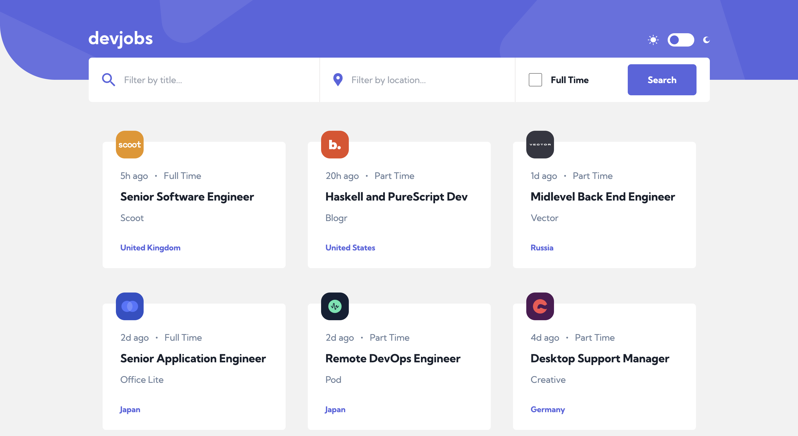

# devjobs
This job board app that pulls data from Firebase. Users can filter based on job title, location and whether the position is full time. Clicking a posting leads to separate page which displays more informaton about the position.

## Demo
[Live Demo](https://nc-devjobs.netlify.app/)

## Built with
- TailwindCSS
- React
- React Router v6
- Vite

## Features
- [x] Be able to filter jobs on the index page by title, location, and whether a job is for a full-time position
- [x] Be able to click a job posting from the index page so that they can read more information and apply for the job
- [x] Toggle the color scheme between light and dark mode

## Lessons Learned
This was my first React app I built on my own. This project was a great opportunity for me to learn and practice my skills in React and React Router. One of the biggest challenges I faced when building this app was figuring out how to filter through the jobs array. Initially, I had set up different `consts` for filtering through the array based on each filter type. However, this approach could only handle filtering the jobs one at a time. After some trial and error, I recalled that I could chain multiple `filter()` methods one after the other to handle multiple filtering options simultaneously. This made filtering through the jobs a breeze and much more precise.

 

I learned how to create dynamic routes. Instead of hardcoding a component to render for every job, I used URL parameters in the `Route` component that appear after a `:` which signals to React that this part of the path is dynamic. Then with each job position title on the cards, I set up `Link` components `to` prop with a value of the `id` property stored within in each object in the array and saved that as the param. I then use React's `useParams` hook to extract the params object, which contained every dynamic path segment that I defined in our routes.

To identify which element in the array matches the `id` of the link we clicked on, I used the `find()` array method. This allowed me to render the correct component dynamically, based on the data passed through the URL parameters. 

## Running this Project Locally
From the repo:
1. Clone this project locally
2. Open the project in your preferred code editor
3. Open your terminal and `cd` to the project directory
4. Run `npm install` to install all relevant dependencies
5. Run `npm run dev` to start a dev server and view the project in your browser

## DevDependencies:
- React
- React Router DOM
- Vite
- autoprefixer
- PostCSS
- TailwindCSS
